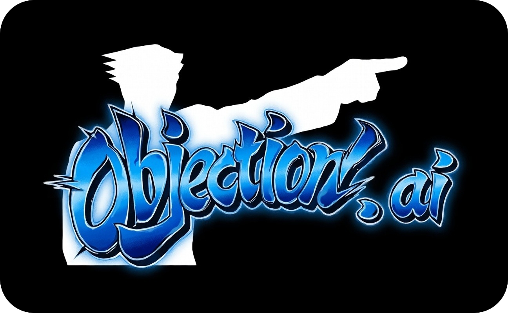

<div align=center>
  <h1>
    Objection.ai
    <br>
    
  </h1>
  <i>The automated AI Case Generator for objection.lol.</i>
  
  **Run:** `objection-ai.exe --room-id <id> --gemini-key <key> --player-username <name>`
  
  [](https://github.com/EduApps-CDG/objection-ai/actions/workflows/ci.yml)
</div>

Objection.ai is a solo-ready AI client for objection.lol that runs full Ace Attorney-style trials without a human Game Master. Powered by `@google/genai`, it generates the case, testimony, evidence, and courtroom twists in real time so every session feels like a fresh episode.

### HOLD IT! Infinite Cases, Zero Waiting

Skip the scripts and scheduling. **Objection.ai** spins up a complete Ace Attorney-style case *on demand* so you can jump straight into cross-examination.

You play as the lone Defense Attorney against an AI that hides the truth. Hit start and a brand-new episode unfolds every time.

### TAKE THAT! Stream-Ready Highlights

* **📺 Solo-first content:** Jump in instantly without scheduling. Boot, record, and crack a case live.
* **🔄 New case every run:** New victims, weapons, witnesses, and twists powered by `@google/genai`.
* **🎭 Reactive testimony:** Press statements, present evidence, and watch the AI improvise under pressure.
* **⚡ Fast setup:** Minimal install time so you can start playing sooner.

### Start the Show in Minutes
1.  Download a build from the [releases](https://github.com/EduApps-CDG/objection-ai/releases) page (or build locally with Bun).
2.  Create a room in [objection.lol](https://objection.lol)
3.  Run example:

```bash
./objection-ai --room-id <id> --gemini-key <key> --player-username <name> --prompt "Turnabout Eleven: A soccer player was murderered during the event using a knife."
```

## [Join the Defense Team](https://github.com/EduApps-CDG/objection-ai/discussions)
*Phoenix Wright: Ace Attorney And All Respective Names are Trademark & © of Capcom.*
This is a fan project and is not affiliated with Capcom.

## Star Us
If you enjoyed crushing the AI prosecutor and uncovering the truth on camera, give this project a star on GitHub. If you have a
feature idea, consider contributing to this project. **This code needs refactoring.**

Active contributors will appear here:

<a href = "https://github.com/EduApps-CDG/objection-ai/graphs/contributors">
  
</a>

**The court is now in session!**